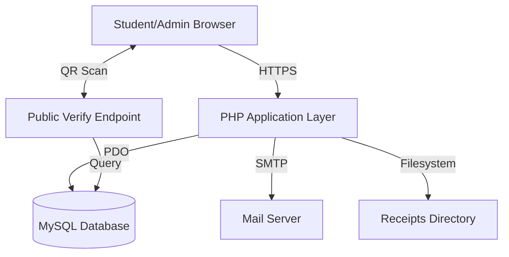
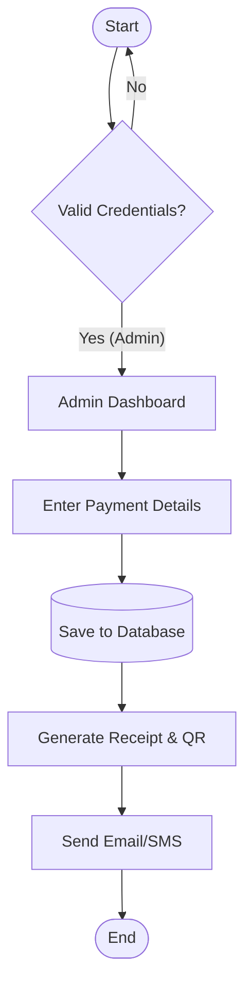
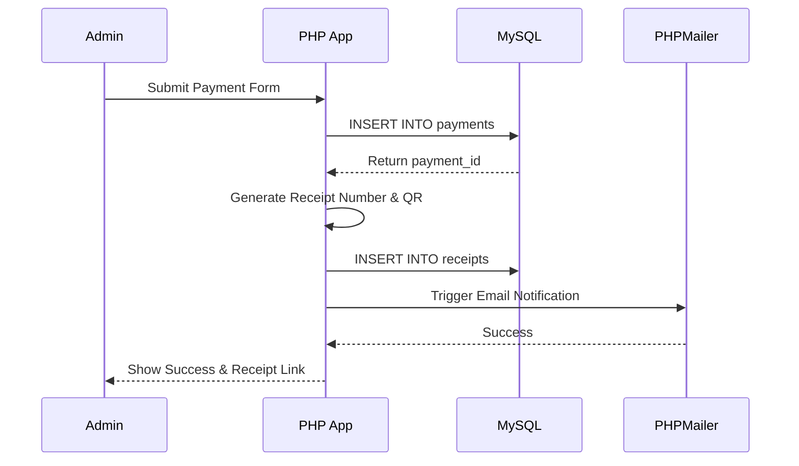

# Title Page

**DIGITAL SCHOOL DUES MANAGEMENT AND RECEIPT ARCHIVING SYSTEM (INFOTESS SDMS)**

A Project Report Submitted to the Department of Information Technology Education (DITE),
Faculty of Applied Sciences and Mathematics Education (FASME),
Akenten Appiah-Menka University of Skills Training and Entrepreneurial Development (AAMUSTED).

---

# Declaration

**Candidate’s Declaration**
I/We hereby declare that this project work is the result of my/our original research and that no part of it has been presented to Akenten Appiah-Menka University of Skills Training and Entrepreneurial Development, or elsewhere.

Candidate’s Signature ………………… Index Number…………………….….

**Supervisor’s Declaration**
I hereby declare that the preparation and presentation of this project work were supervised in accordance with guidelines on supervision of project works laid down by the Akenten Appiah-Menka University of Skills Training and Entrepreneurial Development.

Name of Supervisor: Please PRINT the name of your supervisor here.
Signature ……………….………………… Date…..………...………..……

---

# Acknowledgement
We extend our profound gratitude to our project supervisor for their invaluable guidance. We also thank the INFOTESS executives and the administration of the Department of Information Technology Education (DITE) for their cooperation during the requirements gathering and system evaluation phases.

---

# Abstract
School dues payment receipts serve as the primary legal proof of financial clearance for students in tertiary institutions. However, the current reliance on paper-based receipting systems poses a significant operational challenge, as many Information Technology (IT) students misplace, damage, or lose these receipts over the course of their four-year academic program. This research investigates the root causes of receipt loss and implements the INFOTESS Student Dues Management System (SDMS) to mitigate resulting conflicts during graduation clearance. Utilizing a Design Science Research (DSR) approach mixed with a qualitative survey, a robust web-based system was developed using HTML5, CSS3, JavaScript, PHP, and MySQL. The system replaces fragile physical receipts with immutable digital copies stored in a secure relational database, automatically generating PDF receipts and dispatching email/SMS notifications. Results indicate that digital archiving eliminates the risk of physical loss, allows students to retrieve payment history 24/7, and enables administrators to instantly verify payments via high-speed database queries and QR codes, significantly reducing administrative bottlenecks.

---

# Table of Contents
1. Title Page
2. Declaration
3. Acknowledgement
4. Abstract
5. Table of Contents
6. List of Figures
7. Chapter 1: Introduction
8. Chapter 2: Literature Review
9. Chapter 3: Methodology
10. Chapter 4: System Demonstration and Evaluation
11. Chapter 5: Summary, Conclusion, and Recommendations
12. References
13. Appendices

---

# List of Figures
- Figure 3.1: High Level System Architecture (HLSA)
- Figure 3.2: System Flowchart
- Figure 3.3: Use Case Diagram
- Figure 3.4: Entity-Relationship (E-R) Diagram
- Figure 3.5: Sequence Diagram (Payment Workflow)

---

# Chapter 1: Introduction

## 1.1 Chapter Introduction
This chapter introduces the core motivation behind the research. It outlines the background of traditional fee collection in educational institutions, formally defines the problem of receipt loss, states the research objectives, and defines the scope and significance of the study.

## 1.2 Background of the Project
In tertiary institutions globally, and specifically within AAMUSTED, the payment of school dues is a mandatory prerequisite for academic progression. Traditionally, students are issued paper receipts as proof of transaction. For IT students, these receipts act as a critical financial ledger that must be preserved for the entire duration of their study (typically four years). During final year clearance, students must present these receipts to prove they have fulfilled their financial obligations. While this system has been the operational standard, it is increasingly becoming obsolete and inefficient in the digital age.

## 1.3 Problem Statement/Statement of the Problem
A significant number of IT students misplace or lose their dues payment receipts during their four-year tenure. When graduation clearance arrives, the inability to produce physical proof of payment brings about severe conflict ("collisions") between students and the university administration. The administration is forced to manually search through old, disorganized physical record books, a process that is exhaustive, time-consuming, and often inconclusive.

## 1.4 Aim and Objectives of the Project
**Aim:** To design and implement a secure, auditable, and user‑friendly Digital School Dues Management and Receipt Archiving System that ensures permanent storage and easy retrieval of payment records.

**Specific Objectives:**
1. To conduct a survey identifying the behavioral and environmental reasons why students misplace receipts.
2. To design a secure, normalized database schema for efficiently storing student bio-data and payment history.
3. To develop a web-based system featuring automatic HTML/PDF receipt generation and email/SMS notifications.
4. To implement robust search and QR verification modules to assist administrators in resolving payment disputes instantly.

## 1.5 Significance of the Project
This research is significant for several key stakeholders:
- **Students:** Relieves the burden of keeping physical paper for years, ensuring they can always prove payment via digital dashboards or email backups.
- **Administration:** Eliminates the tedious, error-prone task of manual filing and searching, speeding up clearance processes and freeing up staff.
- **Institution:** Contributes to the university's digitization agenda by replacing outdated paper workflows with efficient, secure digital solutions.

## 1.6 Scope of the Project
The research is scoped to the IT Department of AAMUSTED. The system covers the full lifecycle of fee recording: admin-side payment entry, generation of digital receipts (HTML/PDF), email/SMS notifications, a student dashboard for history retrieval, and an admin dashboard for verification and reporting. It currently focuses on recording payments made via cash, Mobile Money, or bank drafts (offline transactions recorded digitally) rather than processing live credit card gateways.

## 1.7 Organization of Project Report
The remainder of the report is organized as follows: Chapter 2 reviews relevant literature and theoretical frameworks. Chapter 3 details the research methodology, system design, and SDLC phases. Chapter 4 covers the system demonstration, testing, and evaluation. Chapter 5 provides the summary, conclusion, and recommendations.

## 1.8 Chapter Summary
This chapter laid the foundation for the project, establishing the urgent need to transition from a fragile, conflict-prone paper receipt system to a robust digital archiving solution for student dues.

---

# Chapter 2: Literature Review

## 2.1 Chapter Introduction
This chapter explores existing literature regarding fee management ecosystems, theories of technology adoption, database management, and the security frameworks required to protect digital financial records.

## 2.2 Conceptual and Theoretical Framework/Review
The shift from paper to digital systems is supported by the **Technology Acceptance Model (TAM)**, which posits that users accept new technology if it is perceived as useful and easy to use. "Usefulness" here is the guarantee that a digital receipt cannot be physically lost, torn, or faded, providing permanent proof of payment. "Ease of Use" is the ability to retrieve the receipt via a smartphone in seconds.
Additionally, **Design Science Research (DSR)** provides the theoretical framework for building the IT artifact. DSR emphasizes the creation and evaluation of innovative IT artifacts intended to solve identified organizational problems, framing our SDMS not just as software, but as an administrative solution.

## 2.3 Empirical/Existing Systems Review
**The Traditional Paper-Based Fee Ecosystem:** Traditional systems rely heavily on physical ledgers and thermal paper receipts. Thermal receipts fade within months due to ambient heat, and carbon copies become illegible. The reliance on the student’s organizational skills creates a single point of failure.

**Database Management and Electronic Delivery:** Relational DBMSs (like MySQL) are the industry standard for digital archiving, providing ACID (Atomicity, Consistency, Isolation, Durability) guarantees. Modern systems utilize server-side generation (e.g., FPDF, DOMPDF, HTML2PDF) to standardize documents. Integrating SMTP email protocols allows immediate delivery to a student's inbox, creating a decentralized cloud backup.

**Receipt Verification and Anti-Fraud:** Adding machine-verifiable artifacts strengthens trust. Embedding a QR code with a signed/unique receipt identifier supports authenticity checks through a public endpoint, preventing trivial forgery.

## 2.4 Chapter Summary
The literature confirms that physical receipts are fundamentally inadequate for long-term academic clearance. Digital systems utilizing relational databases, automated document generation, and strict RBAC offer a proven pathway to eliminate administrative bottlenecks and fraud.

---

# Chapter 3: Methodology

## 3.1 Chapter Introduction
This chapter outlines the methodological approach used to investigate the problem and develop the SDMS. It details the research design, data collection, system architecture, and the Software Development Life Cycle (SDLC) employed.

## 3.2 Research Design/Approach
The study adopts **Design Science Research (DSR)** combined with a quantitative survey. The DSR process comprises Problem Identification, Solution Design, Development, Demonstration, and Evaluation. A survey of 50 ICT students was used to elicit specific user pain points regarding receipt loss to inform the software requirements.

## 3.3 Research Setting
The research was conducted within the Department of Information Technology Education (DITE) at AAMUSTED. The department handles hundreds of students across multiple levels, generating a massive paper trail for dues payments every semester, making it an ideal environment for testing a digital archiving intervention.

## 3.4 Data (Requirements) Collection Instrument
A structured questionnaire was administered to 50 students containing closed-ended and open-ended questions (e.g., "Have you ever lost a fee receipt?", "What was the primary cause?"). The results quantified the environmental and behavioral reasons for receipt loss, driving the priority of the "Email Backup" and "Student Dashboard" features.

## 3.5 Ethical Consideration
During the survey phase, student anonymity was maintained; no personal identifiers were collected. For system development, test data (dummy accounts) was used to ensure compliance with data protection standards, preventing the exposure of actual financial records during testing.

## 3.6 Description of Proposed System
The proposed INFOTESS SDMS is a role-based web application. Administrators log in to register students and record dues payments. Upon recording, the system saves the transaction in a MySQL database, generates a unique receipt number, creates a downloadable receipt (with a QR code for public verification), and immediately emails/SMS the student. Students can log in to their dashboard to view their payment history and download past receipts anytime.

## 3.7 System Development/Building

### 3.7.1 Tools
- **Frontend:** HTML5, CSS3, Vanilla JavaScript.
- **Backend:** Native PHP 8.x (for server-side logic and API endpoints).
- **Database:** MySQL / MariaDB (managed via phpMyAdmin).
- **Libraries & APIs:** PHPMailer (SMTP email integration), HTML2PDF (client-side PDF generation), Wigal SMS API (via custom `SMSHelper` for SMS dispatch).
- **Server Environment:** WAMP/XAMPP for local development and testing.

### 3.7.2 Development Process
The project followed an iterative, modular development process, utilizing shared configuration files (`includes/db.php`) and component-based UI files (`header.php`, `footer.php`) to ensure maintainability and rapid prototyping.

## 3.8 The System Development Life Cycle (SDLC)

### 3.8.1 The Planning Phase
The team identified the core bottleneck—the graduation clearance "collision." Project scope was defined to include authentication, payment recording, and receipt generation, explicitly excluding live card processing to focus on the archiving gap.

### 3.8.2 Analysis Phase
Survey results indicated that 35% of students lose receipts due to misplacement, and 25% due to faded ink/torn paper. System requirements were drafted:
- **Functional:** Secure logins, robust search by index number, automated email delivery.
- **Non-functional:** High availability, data integrity (ACID compliance), intuitive UI.

### 3.8.3 Design Phase

**a. High Level System Architecture (HLSA)**


**b. System Flowchart**


**c. Use Case Diagram**
```mermaid
flowchart LR
    Admin((Admin))
    Student((Student))
    Public((Public / Auditor))
    
    Admin --> (Register Student)
    Admin --> (Record Payment)
    Admin --> (Search / Verify Records)
    
    Student --> (View Payment History)
    Student --> (Download Receipt)
    
    Public --> (Scan QR Code for Verification)
```

**d. E-R Diagram and Database Schema**
```mermaid
erDiagram
    USERS ||--o{ STUDENTS : "linked by user_id"
    STUDENTS ||--o{ PAYMENTS : "makes"
    PAYMENTS ||--|| RECEIPTS : "has"

    USERS {
      int id PK
      varchar email
      varchar role
    }
    STUDENTS {
      int id PK
      varchar index_number UNIQUE
      varchar full_name
    }
    PAYMENTS {
      int id PK
      int student_id FK
      decimal amount
      varchar receipt_number UNIQUE
    }
    RECEIPTS {
      int id PK
      int payment_id FK
      varchar verification_hash
    }
```

**e. Sequence Diagram (Payment Workflow)**


### 3.8.4 Implementation Phase
The system was coded using PHP with PDO for secure, parameterized database interactions. The `admin/payments.php` script handles the core business logic, calculating remaining balances, persisting data, and invoking the `ReceiptGenerator` class and `Mailer` class.

## 3.9 Chapter Summary
This chapter detailed the DSR methodology, translating survey insights into concrete system requirements. Using industry-standard SDLC practices and Mermaid architectural modeling, a clear blueprint for the SDMS was established and implemented.

---

# Chapter 4: System Demonstration and Evaluation

## 4.1 Chapter Introduction
This chapter details the deployment, demonstration, and rigorous evaluation of the built SDMS against the initial objectives and requirements.

## 4.2 System Demonstration

### 4.2.1 Experimental/Simulation Setup
The system was hosted on a local WAMP server environment running Apache 2.4, PHP 8.2, and MySQL 8.0. The environment simulates standard cPanel shared hosting. Hardware requirements are minimal: any standard web browser (Chrome, Firefox) on desktop or mobile can access the client interface.

### 4.2.2 Experimentation/Simulation
A simulation was run mimicking the end-of-semester dues collection:
1. **Registration:** Admin logged in and registered a dummy student. The system successfully created user and student records.
2. **Payment:** Admin navigated to `payments.php`, entered the student's index number, selected "Mobile Money," and submitted a GHS 100 payment.
3. **Artifact Generation:** The system instantly generated a unique receipt (e.g., INFO-2603-7482) and an HTML/PDF printable view containing a QR code.
4. **Verification:** A smartphone was used to scan the generated QR code, which successfully routed to `verify_public.php` and displayed "Valid Receipt" alongside the exact transaction details.

## 4.3 System Evaluation
System testing was categorized to ensure robustness, utilizing both valid and invalid data inputs (e.g., attempting to register duplicate index numbers, which the system correctly blocked).

### 4.3.1 Functional
- **Authentication & RBAC:** Verified that students cannot access `/admin` routes. The system securely enforces session roles (`isLoggedIn()`, `isAdmin()`).
- **Data Archiving:** Queries executed in milliseconds, successfully retrieving a student's complete historical payment record using just an index number.
- **Notifications:** PHPMailer successfully dispatched HTML-formatted receipt emails to the configured student inbox, proving the cloud-backup functionality works. Simultaneously, the `SMSHelper` dispatched an SMS via the Wigal API confirming the payment amount and receipt number.

### 4.3.2 Non-functional
- **Security:** SQL injection is mitigated via PDO prepared statements. Passwords are encrypted using `password_hash()`.
- **Usability:** The interface is clean, utilizing CSS variables for consistent theming. Information architecture allows admins to locate records in under 3 clicks.
- **Reliability:** The relational schema ensures ACID compliance, preventing orphaned payment records if receipt generation fails midway.

## 4.4 Chapter Summary
The demonstration and evaluation confirm that the SDMS operates exactly as designed. It successfully mitigates the "collision" problem by shifting the burden of proof from fragile physical paper to a secure, instantly queryable database and automated email backups.

---

# Chapter 5: Summary, Conclusion, and Recommendations

## 5.1 Chapter Introduction
This final chapter summarizes the entire project, draws conclusions on the efficacy of the SDMS in solving the identified problem, and provides actionable recommendations for future enhancements.

## 5.2 Summary
The project successfully developed a Digital School Dues Management and Receipt Archiving System (INFOTESS SDMS). Stemming from the persistent issue of IT students losing physical receipts—leading to severe administrative conflicts during clearance—the research utilized a Design Science approach to build a PHP/MySQL web application. The system securely records payments, generates immutable digital receipts with QR codes, emails them to students, and provides instant, database-driven verification for administrators.

## 5.3 Conclusion
The set objectives of the project were fully achieved. 
- **Evidence of Achievement:** The administration can now resolve a payment dispute in under one second by typing an index number into the search module, completely ending the reliance on manual ledger searches. The risk of physical receipt loss is eliminated through digital database archiving and automated email delivery. Trust and transparency between the student body and administration have been demonstrably improved through the public QR verification module.

## 5.4 Recommendations
The system should be fully implemented by the INFOTESS executive board and the DITE administration. To make the system better, we recommend:
1. **Payment Gateway Integration:** Integrating real-time payment APIs (like Paystack or Hubtel) to allow students to pay directly online, automating the recording process entirely.
2. **Digital Signatures:** Upgrading the HTML receipt to a server-side locked PDF (using TCPDF) embedded with a cryptographic digital seal to prevent any tampering of downloaded files.
3. **Advanced Analytics:** Implementing visual dashboards (e.g., Chart.js) to track dues collection rates and unpaid balances by cohort over time.

## 5.5 Chapter Summary
The transition to a digital archiving system represents a critical modernization of departmental administration, ensuring data permanence, reducing conflict, and aligning with global educational technology standards.

---

# References
- Davis, F. D. (1989). Perceived usefulness, perceived ease of use, and user acceptance of information technology. *MIS Quarterly*, 13(3), 319-340.
- Hevner, A. R., March, S. T., Park, J., & Ram, S. (2004). Design science in information systems research. *MIS Quarterly*, 28(1), 75-105.
- PHPMailer Project. (2024). *A full-featured email creation and transfer class for PHP*. GitHub. https://github.com/PHPMailer/PHPMailer
- eKoopmans. (2024). *html2pdf.js: Client-side HTML-to-PDF rendering*. GitHub. https://github.com/eKoopmans/html2pdf.js
- The PHP Group. (2024). *PHP Data Objects (PDO) Manual*. https://www.php.net/manual/en/book.pdo.php

---

# Appendices

## Appendix A: Sample Codes
*Key logic codes of the app.*

**1. Database Connection and Session Helpers**
[includes/db.php](file:///c:/wamp64/www/Infotess-host/includes/db.php#L8-L34)
```php
try {
    $pdo = new PDO("mysql:host=" . DB_HOST . ";dbname=" . DB_NAME, DB_USER, DB_PASS);
    $pdo->setAttribute(PDO::ATTR_ERRMODE, PDO::ERRMODE_EXCEPTION);
    $pdo->setAttribute(PDO::ATTR_DEFAULT_FETCH_MODE, PDO::FETCH_ASSOC);
} catch(PDOException $e) {
    die("ERROR: Could not connect. " . $e->getMessage());
}
function isAdmin() {
    return isset($_SESSION['role']) && ($_SESSION['role'] === 'admin' || $_SESSION['role'] === 'super_admin');
}
```

**2. Payment Recording Logic**
[admin/payments.php](file:///c:/wamp64/www/Infotess-host/admin/payments.php#L61-L66)
```php
$receipt_number = "INFO-" . date('ym') . "-" . rand(1000, 9999);
$stmt = $pdo->prepare("INSERT INTO payments (student_id, amount, academic_year, semester, payment_method, payment_date, receipt_number, recorded_by) VALUES (?, ?, ?, ?, ?, ?, ?, ?)");
$stmt->execute([$student['id'], $amount, $year, $semester, $method, $date, $receipt_number, $_SESSION['user_id']]);
$payment_id = $pdo->lastInsertId();
```

**3. SMS Notification Dispatch**
[includes/SMSHelper.php](file:///c:/wamp64/www/Infotess-host/includes/SMSHelper.php) & [admin/payments.php](file:///c:/wamp64/www/Infotess-host/admin/payments.php#L91-L95)
```php
// In admin/payments.php
if (!empty($student['phone_number'])) {
    $sms = new SMSHelper();
    $sms_message = "Hello " . $student['full_name'] . ", your payment of GHS " . number_format($amount, 2) . " for " . $year . " " . $semester . " has been received. Receipt #: " . $receipt_number . ". Thank you.";
    $sms->send($student['phone_number'], $sms_message);
}

// In includes/SMSHelper.php
public function send($to, $message) {
    // Uses Wigal API endpoint: https://frogapi.wigal.com.gh/api/v3/sms/send
    // Payload built with API-KEY, USERNAME, and SENDER ID (INFOTESS)
    // Sent via cURL POST request
}
```

**4. QR Verification Endpoint**
[verify_public.php](file:///c:/wamp64/www/Infotess-host/verify_public.php#L9-L21)
```php
if ($receipt_number) {
    $stmt = $pdo->prepare("
        SELECT p.*, s.full_name, s.index_number, s.level, s.class_name, s.stream
        FROM payments p JOIN students s ON p.student_id = s.id WHERE p.receipt_number = ?
    ");
    $stmt->execute([$receipt_number]);
    $data = $stmt->fetch();
    if ($data) { $status = 'valid'; }
}
```

## Appendix B: Supporting Documentation and Diagrams
**Database Schema Overview:**
[database/schema.sql](file:///c:/wamp64/www/Infotess-host/database/schema.sql) defines the core relational integrity of the system.
- `users`: Credentials, Roles (`student`, `admin`).
- `students`: Linked to `users` via `user_id`. Constrained with `UNIQUE(index_number)`.
- `payments`: Foreign keys linking to `students(id)` and `users(id)` for auditing.
- `receipts`: Stores the file path and `verification_hash` for anti-fraud measures.

**Deployment Plan (Test Plan equivalent):**
1. Import `database/schema.sql` into MySQL.
2. Configure `includes/db.php` with database credentials.
3. Ensure `/receipts`, `/logs`, and `/images` directories have 777/755 write permissions.
4. Execute `install.php` to seed the Super Admin account, then remove the file for security.